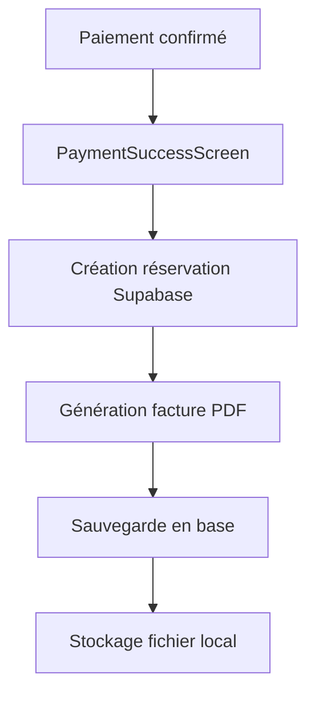
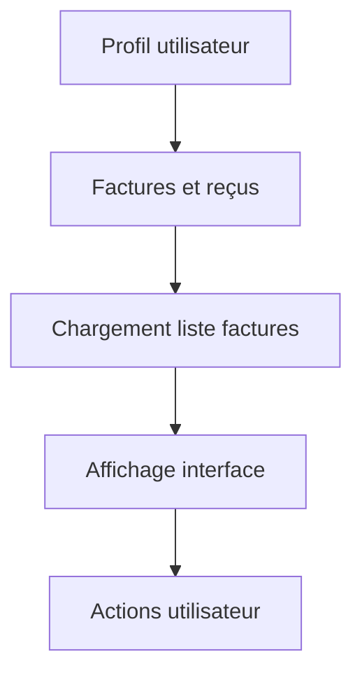

# 📋 Guide de Configuration - Système de Facturation TravelHub

## 🎯 Vue d'ensemble

Le système de facturation automatique de TravelHub génère des factures PDF professionnelles à chaque réservation confirmée. Les factures sont stockées dans Supabase et peuvent être téléchargées/partagées depuis l'application.

## 📊 Fonctionnalités

- ✅ **Génération automatique** de factures PDF après chaque paiement
- ✅ **Stockage sécurisé** dans Supabase avec RLS (Row Level Security)
- ✅ **Interface utilisateur** dédiée pour consulter les factures
- ✅ **Téléchargement et partage** des factures
- ✅ **Calcul automatique** des taxes (TVA 19.25% Cameroun)
- ✅ **Numérotation séquentielle** automatique
- ✅ **Design professionnel** avec logo et informations complètes

## 🔧 Installation

### 1. Base de données

Exécutez le script SQL suivant dans votre console Supabase :

```bash
# Naviguez vers le dossier du projet
cd TravelHub

# Le script SQL se trouve dans :
src/database/create-invoices-table.sql
```

**Instructions :**
1. Connectez-vous à votre [console Supabase](https://supabase.com/dashboard)
2. Allez dans `SQL Editor`
3. Copiez-collez le contenu de `create-invoices-table.sql`
4. Exécutez le script

### 2. Dépendances

Les dépendances suivantes ont été installées automatiquement :

```json
{
  "expo-print": "^12.0.0",
  "expo-sharing": "^12.0.0", 
  "expo-file-system": "^16.0.0"
}
```

Si elles ne sont pas installées, exécutez :

```bash
npm install expo-print expo-sharing expo-file-system
```

## 📱 Utilisation

### Accès aux factures

1. **Via le profil utilisateur :**
   - Allez dans `Profil` → `Mes voyages` → `Factures et reçus`

2. **Navigation directe :**
   ```javascript
   navigation.navigate('Invoices')
   ```

### Actions disponibles

- **📋 Consultation** : Liste de toutes les factures de l'utilisateur
- **📥 Téléchargement** : Génération et partage du PDF
- **🗑️ Suppression** : Suppression sécurisée (avec confirmation)
- **🔄 Actualisation** : Rechargement des données

## 🔄 Flux de fonctionnement

### 1. Génération automatique



### 2. Consultation utilisateur



## 📋 Structure de la table `invoices`

```sql
CREATE TABLE public.invoices (
    id UUID PRIMARY KEY,
    booking_id UUID REFERENCES bookings(id),
    user_id UUID REFERENCES auth.users(id),
    invoice_number TEXT UNIQUE,
    amount NUMERIC,           -- Montant HT
    tax_amount NUMERIC,       -- Montant TVA
    total_amount NUMERIC,     -- Montant TTC
    currency TEXT DEFAULT 'FCFA',
    status TEXT DEFAULT 'generated',
    file_path TEXT,
    generated_at TIMESTAMPTZ,
    sent_at TIMESTAMPTZ,
    paid_at TIMESTAMPTZ,
    metadata JSONB
);
```

## 🎨 Personnalisation

### Modifier le design des factures

Éditez la fonction `generateInvoiceHTML()` dans `src/services/invoiceService.js` :

```javascript
// Personnaliser les couleurs
const COLORS = {
  primary: '#007AFF',
  success: '#28a745',
  // ...
};

// Modifier le template HTML
const htmlTemplate = `
  <!-- Votre design personnalisé -->
`;
```

### Ajouter des champs métadonnées

```javascript
const invoiceData = {
  // ... champs existants
  metadata: {
    custom_field: 'valeur',
    // Ajoutez vos champs personnalisés
  }
};
```

## 🔒 Sécurité

### Row Level Security (RLS)

Les politiques de sécurité assurent que :

- ✅ Les utilisateurs ne voient que leurs propres factures
- ✅ Pas d'accès cross-utilisateur
- ✅ Intégrité des données garantie

### Validation des données

```javascript
// Validation automatique dans le service
if (!userData?.id) {
  throw new Error('Utilisateur non authentifié');
}

if (!bookingData?.total_price_fcfa) {
  throw new Error('Montant de facture invalide');
}
```

## 📊 Calculs automatiques

### TVA Cameroun (19.25%)

```javascript
const TVA_RATE = 0.1925;
const amount = Math.round(totalPrice / (1 + TVA_RATE));
const tax_amount = totalPrice - amount;
```

### Numérotation séquentielle

Format : `TH-YYYY-MM-XXXXXX`
- `TH` : Préfixe TravelHub
- `YYYY-MM` : Année-Mois
- `XXXXXX` : Numéro séquentiel (6 chiffres)

Exemple : `TH-2025-08-000001`

## 🐛 Dépannage

### Problèmes courants

1. **"Aucun fichier PDF disponible"**
   ```javascript
   // Solution : Régénération automatique
   const newPdfUri = await invoiceService.regenerateInvoicePDF(invoice);
   ```

2. **"Partage non disponible"**
   ```javascript
   // Vérification de la disponibilité
   if (await Sharing.isAvailableAsync()) {
     await Sharing.shareAsync(fileUri);
   }
   ```

3. **Erreur de permissions fichier**
   ```javascript
   // Créer le dossier s'il n'existe pas
   await FileSystem.makeDirectoryAsync(
     FileSystem.documentDirectory + 'invoices/',
     { intermediates: true }
   );
   ```

### Logs de débogage

```javascript
console.log('🧾 Création facture:', invoiceData);
console.log('📄 PDF généré:', pdfUri);
console.log('✅ Facture sauvée:', savedInvoice);
```

## 🚀 Extensions possibles

### 1. Envoi par email
```javascript
// Intégrer avec un service email
await emailService.sendInvoice(invoiceData, userEmail);
```

### 2. Archivage cloud
```javascript
// Upload vers Supabase Storage
const { data } = await supabase.storage
  .from('invoices')
  .upload(`${userId}/${invoiceNumber}.pdf`, pdfFile);
```

### 3. Factures groupées
```javascript
// Pour les réservations multiples
const groupedInvoice = await invoiceService.createGroupedInvoice(bookings);
```

## ✅ Tests

### Test de génération
```javascript
// Test simple
const invoice = await invoiceService.createInvoice(mockBooking, mockUser);
console.log('Facture générée:', invoice.invoice_number);
```

### Test de téléchargement
```javascript
// Test partage
await invoiceService.downloadInvoice(invoice);
```

## 📚 Fichiers concernés

```
src/
├── services/
│   └── invoiceService.js       # Service principal
├── screens/
│   ├── Invoices/
│   │   └── InvoicesScreen.js   # Interface utilisateur
│   └── Payment/
│       └── PaymentSuccessScreen.js # Intégration auto
├── hooks/
│   └── useAuth.js              # Hook authentification
├── navigation/
│   └── AppNavigator.js         # Configuration routes
└── database/
    └── create-invoices-table.sql # Script de création
```

## 🎯 Prochaines étapes

1. ✅ **Testez** la génération de factures après une réservation
2. ✅ **Vérifiez** l'affichage dans l'écran des factures
3. ✅ **Personnalisez** le design selon vos besoins
4. ✅ **Configurez** l'envoi par email (optionnel)
5. ✅ **Déployez** en production

---

## 📞 Support

Pour toute question technique :
- 📧 Email : support@travelhub.cm
- 📱 WhatsApp : +237 6XX XXX XXX
- 💬 GitHub Issues

---

**🎉 Félicitations ! Votre système de facturation est maintenant configuré et prêt à l'usage !**
